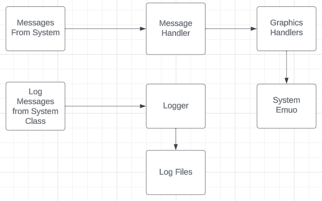

# Logging Systems and Display Python API
This api written so that the user can send messages to the `message handler` class and then the system will display it to the user. \
NOTE: Different display interfaces are contained on different branches. \
In addition this class can be used to send messages to threads. In the system.



## Message Handler class
This class is the mail man of the systems. 
### Functions:
1. `__init__`: Constructor, this sets up the class. NOTE: That mutex locking is set up here as well.
2. `set_thread_handler`: This function is used so that the `message handler` can get access to the `thread  handler`.
3. `send_message_permanent`: Send message that will not be erased after some time.
4. `print_message`: Send message that will be erased after some time.
5. `report_thread`: Send message that will appear under the threading report.
6. `report_bytes`: Send messes that will report the byte count.
7. `flush`: write message log to the screen.
8. `flush_prem`: write permanent message log to screen.
9. `flush_thread_report`: write thread report to the screen. 
10. `flush_bytes`: write bytes to the screen.
11. `clear_disp` : clear the display. 
12. `run` : start the class, and refresh display at the refresh rate. 
11. `get_system_emuo` : returns the `system_emuo` class. (The class that is being used to actually display the info.)
12. `send_request` : This function maps threading requests into the thread handler. 
13. `get_return` : This function maps the return value of a thread to the caller. 

### HOW TO:
The main function that will be used is the `send_request` and `get_return` functions. When a request is sent, it will return an id. That id should be passed into get_return. `Get_return` will then go and check if that id has a return value. If if doesn't have a return value yet then it returns `None`. This is to avoid gride lock, and having to wait for the thread to finish. Thus the users should call  `get_return` periodically and check to see if the return value is `None`.

## Graphics Handler
This class is the formatter of the system.
### Function:
1. `__init__`: Sets up class, not that it class the `super()._init__(self.__coms)` this is the `systemEmuo` class. 
2. `write_message_log`: Passes the logs to the display class.
3. `send_message`: Adds a messages to the back log of messages that needs to be printed. 
4. `send_message_permanent` : Adds a messages to the back log of permanent messages that needs to be printed. 
5. `write_message_permanent_log`: Passes the logs to the display class.
6. `report_thread`: adds the new report to the local variable to be displayed. 
7. `write_thread_report`: Formats and sends the thread report to the display.
8. `write_byte_report`: Passes the byte report to the display. 
9. `report_byte`: Adds a byte report to the log.

### HOW TO:
This class is largely meant to be replace for new applications. In other words it should be application specific. When writing a new class, jsut make sure to match the structure of this class, and match the function names and it should work well with the system. 

## `systemEmuo`
This class handles the display. It is largely application specific. So I will not explain it in detail here. \
However one function is of note: \
`print_old_continuos`: this function simple is how you tell this class to print. It is what the `graphics handler` expects to use. 

## `logging`
This class is a simple logger. Give it a file name and tell it to log messages when you want to. 

## Compiling README.md with pandocs
    To compile .md to a pdf: pandoc -s README.md -V geometry:margin=1in -o README.pdf
    To compile to a stand alone html doc: pandoc  --metadata title="README" -s --self-contained README.md -o README.html

## Linting
This is the method that is used to check the code and make sure it fits coding standard and best practice. The package is called `pylint` and can be installed with \
``` python
    pip install pylint  
```
or 
```python
    pip3 install pylint 
```
depending on context. The command to run `pylint` is:
```python
    python3 -m pylint --jobs 0 --rcfile .pylintrc <name of python file or folder>
```